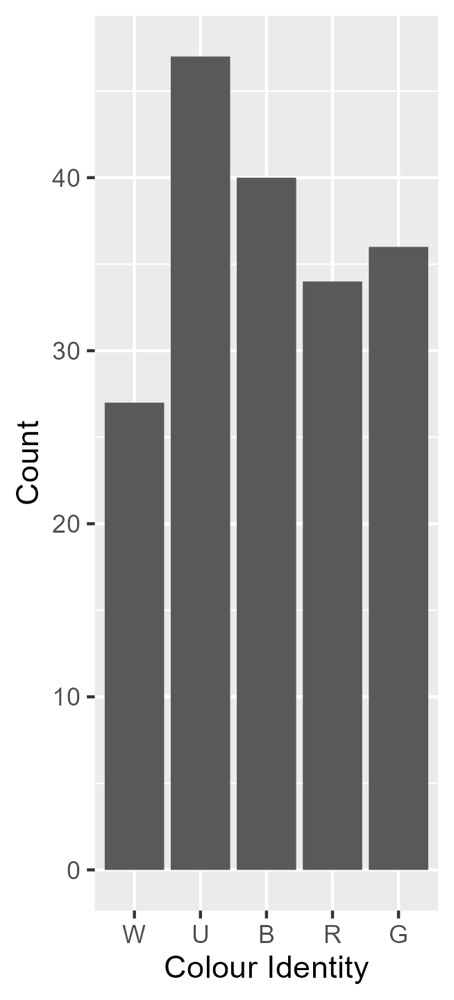

# Magic

Hello! 
After setting up some code to play around with the cEDH Metagame data [@SquirrelmobMTG](https://twitter.com/SquirrelmobMTG) created, I decided to make my deck stats public, so here they are. I use an R script that creates data for every deck and then I play around with some stats. 

For context, I've been playing (with interruption from 2019-2021) since 2013 and started cEDH in 2022.  I'm also a researcher and really enjoy data viusualisation, so here we are. 

I divide all my decks into cathegorical power levels: 
- low: This deck is here so I can play pet cards while chatting to the other players 
- PreCon: roughly comparable to a pre-2018 unedited precon. These decks are for whacky strategies 
- mid: If it survives a LGS meta, it's mid 
- high: I refuse to play it against precons, because that feels like pubstomping 
- cEDH: for tournaments

Additionally, while I am proxy friendly, I like playing FNMs at the LGS which means I can't use proxies, so the majority of my decks are proxy free. 

I have 41 decks across formats including: 
|format|n|
|---|---|
|EDH|33|
|pEDH|1|
|Dual Commander|2|
|Oathbreaker|1|
|modern|1|
|Horde|2|

If you want decklists (besides the Horde ones), they're on [Moxfield](https://www.moxfield.com/users/AliceInQuantumland). The stats you see here additionally exlude Oathbreaker and Modern. 

But you're here for deck stats (or to borrow the code for your own decks, let me know, if you do)

First of all, a colour pie. 

Many Magic: The Gathering players like to pick a favourite shard and guild but my decks are pretty much balanced due to a couple of reasons: 
- 2013-2019: I mainly played Grixis and had a huge Dimir banner in my room (even though my favourite guild were the Simic)
- 2021-2022: Returning to magic after a two year break*, I just wanted to build Sultai decks but after downsizing my collection, I'm down to 2.
- 2023-present: Nowadays it's all pretty balanced. Universes Beyond:Doctor Who happened. You'll see how that messed with my deck starts in the artist and plane stats.

*caused by having to get rid of my collection during a rushed move when I lost some research funding)

Fun fact: the colours in the pie chart come from a random google search image pointing out the rgb values of mana symbols.

Now, all stats have flaws and in this case, one notable thing is that we can't provide is equal games per deck. For all the decks that have been fully assembled, this is how often they've been played (by me or others): 

When it comes to win stats, I have a couple of points that are important to understand why things look the way they look: 
- There are four players in your average EDH pod. If your deck has a ~25% win rate, you have balanced it correctly for its power level
- In cEDH, you will want a higher than average win to get through tournaments. I chose to set that to ~40%
- Decks with less than 5 games are likely to have major changes in where they plot in the future. 

For the FNM LGS decks, there's a couple of notable outliers. 

I decided to plot wins by deck type, not by power level which is why the high power [Jeleva](https://www.moxfield.com/decks/wa9WtU4FeEO7RsyPj5zawg) deck is where it is.

Not all decks want to win. Notable mentions here include [Parnesse](https://www.moxfield.com/decks/FxogC8HyLESeMO0RKeZ5iQ) and [Zedruu](https://www.moxfield.com/decks/OyJB7Ux9cUyQ8c9tzjDpzg)

If you are good with R, please help me with me Magic stats To Do list:
- find a way to pull static data of moxfield and scryfall
- make the planes stats look more like a map
- find an easier way to log new game results 

I also write articles including science communication themed deck techs. So far, you can read: 
- [Gifts to the Table (Parnesse)](https://quantumlandbooks.tumblr.com/post/688027749349228544/gifts) (now The Stack Is Your Wonderland)
- [The Mathematics of Infection (Alesha)](https://quantumlandbooks.tumblr.com/post/678417387877449728/the-mathematics-of-infection) (no longer played)
