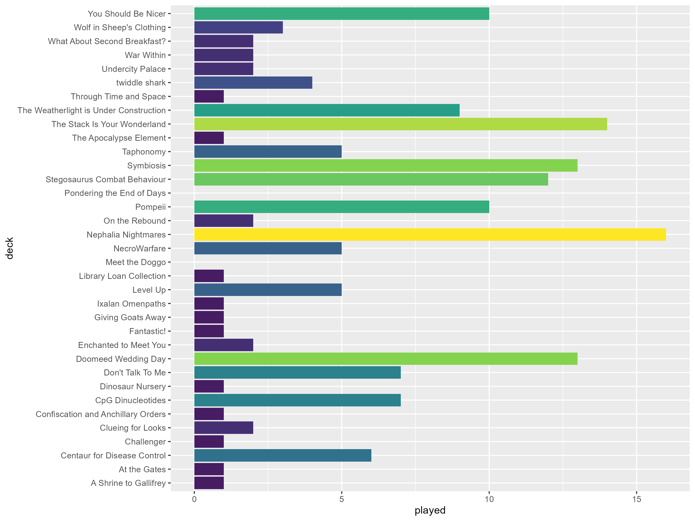
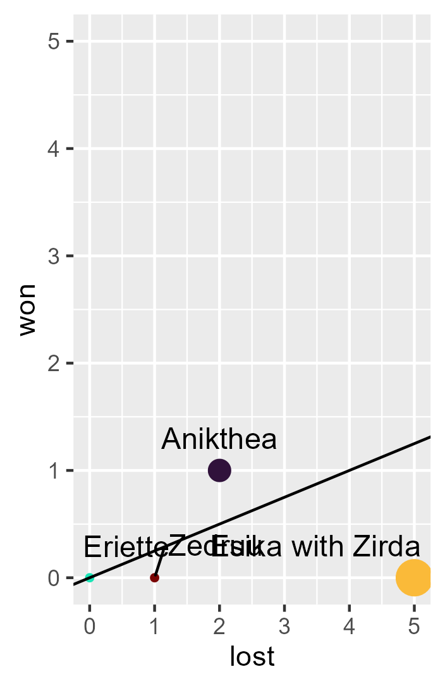
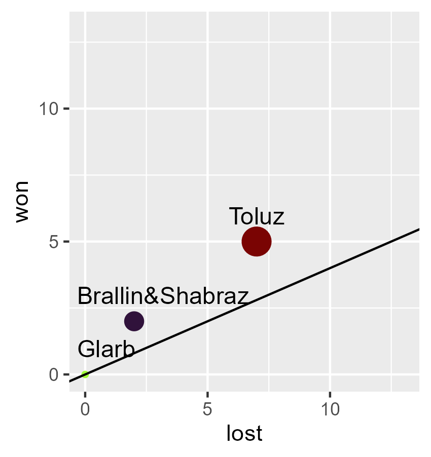
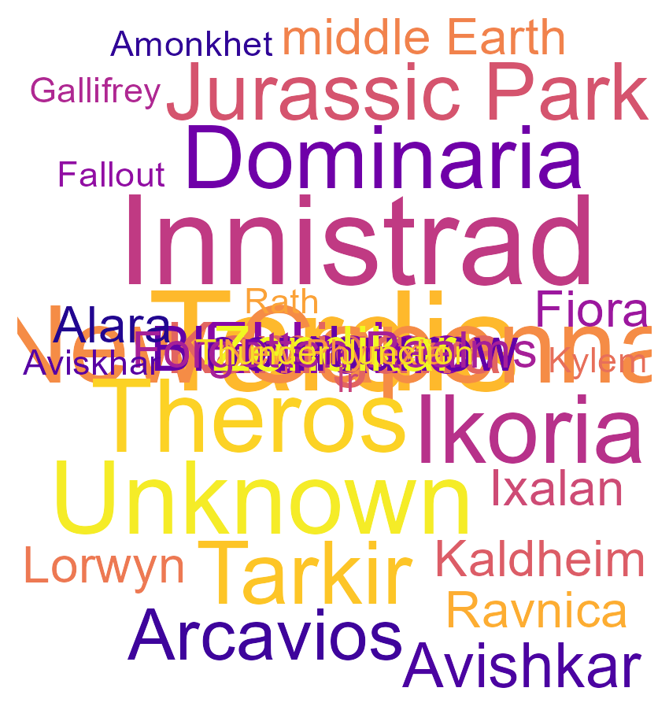
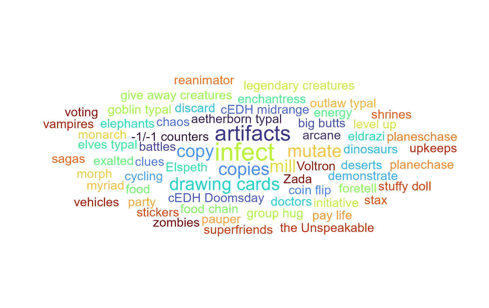

# Magic

Hello! 
After setting up some code to play around with the cEDH Metagame data [@SquirrelmobMTG](https://twitter.com/SquirrelmobMTG) created, I decided to make my deck stats public, so here they are. I use an R script that creates data for every deck and then I play around with some stats. 

For context, I've been playing (with interruption from 2019-2021) since 2013 and started cEDH in 2022.  I'm also a researcher and really enjoy data viusualisation, so here we are. 

I divide all my decks into cathegorical power levels: 
- low: This deck is here so I can play pet cards while chatting to the other players 
- PreCon: roughly comparable to a pre-2018 unedited precon. These decks are for whacky strategies 
- mid: If it survives a LGS meta, it's mid 
- high: I refuse to play it against precons, because that feels like pubstomping 
- cEDH: for tournaments

Additionally, while I am proxy friendly, I like playing FNMs at the LGS which means I can't use proxies, so the majority of my decks are proxy free. 

I have 41 decks across formats including: 
|format|n|
|---|---|
|EDH|33|
|pEDH|1|
|Dual Commander|2|
|Oathbreaker|1|
|modern|1|
|Horde|2|

If you want decklists (besides the Horde ones), they're on [Moxfield](https://www.moxfield.com/users/AliceInQuantumland). The stats you see here additionally exlude Oathbreaker and Modern. 

But you're here for deck stats (or to borrow the code for your own decks, let me know, if you do)

First of all, a colour pie. 

Many Magic: The Gathering players like to pick a favourite shard and guild but my decks are pretty much balanced due to a couple of reasons: 
- 2013-2019: I mainly played Grixis and had a huge Dimir banner in my room (even though my favourite guild were the Simic)
- 2021-2022: Returning to magic after a two year break*, I just wanted to build Sultai decks but after downsizing my collection, I'm down to 2.
- 2023-present: Nowadays it's all pretty balanced. Universes Beyond:Doctor Who happened. You'll see how that messed with my deck starts in the artist and plane stats.

*caused by having to get rid of my collection during a rushed move when I lost some research funding)

Fun fact: the colours in the pie chart come from a random google search image pointing out the rgb values of mana symbols.

Now, all stats have flaws and in this case, one notable thing is that we can't provide is equal games per deck. For all the decks that have been fully assembled, this is how often they've been played (by me or others): 

When it comes to win stats, I have a couple of points that are important to understand why things look the way they look: 
- There are four players in your average EDH pod. If your deck has a ~25% win rate, you have balanced it correctly for its power level
- In cEDH, you will want a higher than average win to get through tournaments. I chose to set that to ~40%
- Decks with less than 5 games are likely to have major changes in where they plot in the future. 

For the FNM LGS decks, there's a couple of notable outliers. 

I decided to plot wins by deck type, not by power level which is why the high power [Jeleva](https://www.moxfield.com/decks/wa9WtU4FeEO7RsyPj5zawg) deck is where it is. The other high power decks that are outliers are [Jhoira](https://www.moxfield.com/decks/jLFKB8hsVEalMDUZzieFDQ) and [Gallia](https://www.moxfield.com/decks/HuLxRxvIu0WlLzUwmdk46g) since I didn't start logging games from scratch since changing them down from being experimental cEDH decks. I think the stats explain why I don't play these decks in cEDH games anymore. 

On a completely different note, not all decks want to win. Notable mentions here include [Parnesse](https://www.moxfield.com/decks/FxogC8HyLESeMO0RKeZ5iQ) and [Zedruu](https://www.moxfield.com/decks/OyJB7Ux9cUyQ8c9tzjDpzg). I'm still working on getting [Esika's](https://www.moxfield.com/decks/0WLCVK5L7kCZUuW1V2PMtg) win rate up but no amount of explaining in the rule 0 that the goal of the deck is not to have the Prismatic Bridge snowball has helped. 

If you are still reading the win stats, I'm going to guess that the cEDH win stats are the most interesting for you. My [topdeck tournament record](https://topdeck.gg/profile/Kr4LkhkJa8bPBUasCL0Olu13D153) is pretty abysmal but I've been working on that by focussing on only one deck and deciding to no longer play online tournaments, because I noticed a start contrast in enjoyability of games and inappropriate conduct by opponents between playing in person and via webcam. My one remaining deck is [Toluz](https://www.moxfield.com/decks/jIQUKoqnmUi560I-XWEWWg) which I built the day cEDH TV dropped their [New Capenna episode](https://www.youtube.com/watch?v=ggs5vaB3JHw&pp=ygUTY2VkaCB0diBuZXcgY2FwZW5uYQ%3D%3D). 

There's a couple of decks that don't have stats yet, because I haven't finished them. Stay tuned for stats on: 
- Runo
- Breya
- Obeka
- Vislor&The Second Doctor
- Piru
- Vial Smasher
- Peri Brown & The Fourteenth Doctor

I really like art, so I also track artists. There are a couple of notable ones: 
- Wangjie Li is the top artist in the stats.
- My favourite magic artists are Jesper Ejsing, Johannes Voss, and Magali Villeneuve but I also really like shiny cards which is why they're not represented here... yet
- Here we start seeing an interesting side effect of the way I record data which is that two characters on the art are counted twice for artist and plane. This was extra fun back when my [Vislor and Second Doctor](https://www.moxfield.com/decks/fD7I-DpVe0eQ1xVii4L7cg) deck was helmed by the Sen Triplets. 

Now, for the planes, I would love to do a map but for that I have to draw a map of the multiverse and then assign fake coordinates by deciding the alignment of the planes... a project for another day. For now, we have another dot plot. 

Have I mentioned that I like Doctor Who?

Finally, we have the deck themes. Initially, I was using this to reduce my overall deck numer. Back when I had too many decks, "Energy" would have been a major size her but by now, I think I've narrowed it down so that the decks are sufficiently different. 

If you liked the stats and are good with R, please help me with me Magic stats To Do list:
- find a way to pull static data of moxfield and scryfall
- make the planes stats look more like a map
- find an easier way to log new game results 

I also write articles including science communication themed deck techs. So far, you can read: 
- [Gifts to the Table (Parnesse)](https://quantumlandbooks.tumblr.com/post/688027749349228544/gifts) (now The Stack Is Your Wonderland)
- [The Mathematics of Infection (Alesha)](https://quantumlandbooks.tumblr.com/post/678417387877449728/the-mathematics-of-infection) (no longer played)
