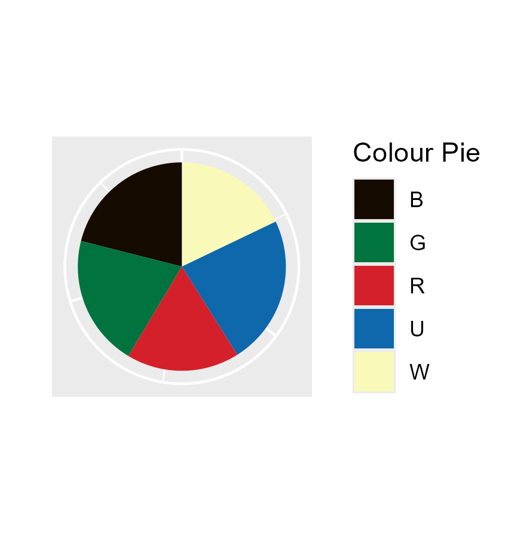

# Magic

Hello! 
After setting up some code to play around with the cEDH Metagame data [@SquirrelmobMTG](https://twitter.com/SquirrelmobMTG) created, I decided to make my deck stats public, so here they are. I use an R script that creates data for every deck and then I play around with some stats. 

For context, I've been playing (with interruption from 2019-2021) since 2013 and started cEDH in 2022.  I'm also a researcher and really enjoy data viusualisation, so here we are. 

First of all, a colour pie. 

Many Magic: The Gathering players like to pick a favourite shard and guild but my decks are pretty much balanced due to a couple of reasons: 
- 2013-2019: I mainly played Grixis and had a huge Dimir banner in my room (even though my favourite guild were the Simic)
- 2021-2022: Returning to magic after a two year break*, I just wanted to build Sultai decks but after downsizing my collection, I'm down to 2.
- 2023-present: Universes Beyond:Doctor Who happened. You'll see how that messed with my deck starts in the artist and plane stats.
*caused by having to get rid of my collection during a rushed move when I lost some research funding)

I divide all my decks into cathegorical power levels: 
- low: This deck is here so I can play pet cards while chatting to the other players 
- PreCon: roughly comparable to a pre-2018 unedited precon. These decks are for whacky strategies 
- mid: If it survives a LGS meta, it's mid 
- high: I refuse to play it against precons, because that feels like pubstomping 
- cEDH: for tournaments

Nowadays it's all pretty balanced. 
Fun fact: the colours in the pie chart come from a random google search image pointing out the rgb values of mana symbols.

You can read more about how I codify powerlevel for my own decks here (Article coming soon). If you want decklists, they're on [Moxfield](https://www.moxfield.com/users/AliceInQuantumland).

I also write articles including science communication themed deck techs. So far, you can read: 
- [Gifts to the Table (Parnesse)](https://quantumlandbooks.com/post/688027749349228544/gifts) (now The Stack Is Your Wonderland)
- [The Mathematics of Infection (Alesha)](https://quantumlandbooks.com/post/678417387877449728/the-mathematics-of-infection) (no longer played)
